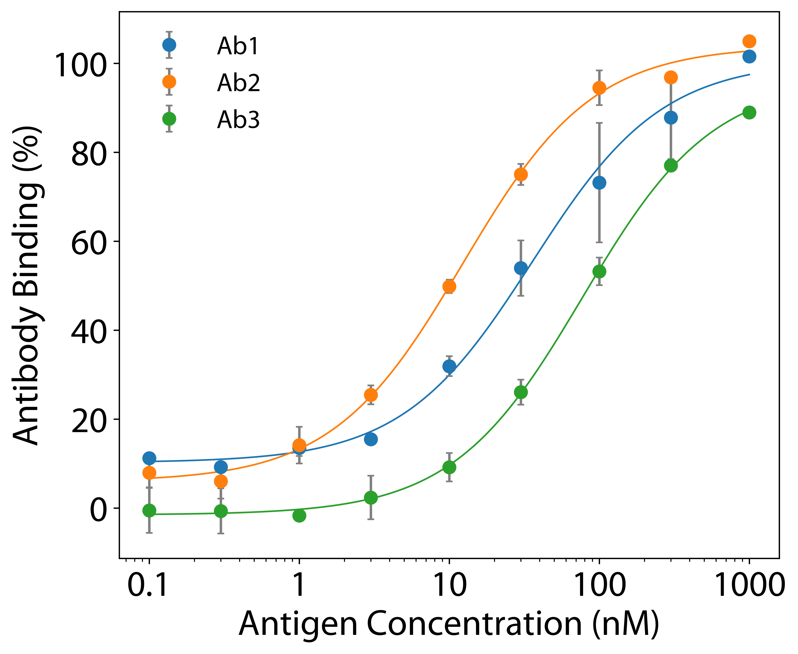

# Data_Fitting
Script for fitting data to a user specified curve from a standard excel file.


This script will can take data saved in an excel file and produce graphs of the data with fitted curves based on a user defined curve.

## Example:

```python
def logistic(c, TOP, BOTTOM, EC50):
    return BOTTOM + (TOP - BOTTOM) * c / (c + EC50)

colors = [plt.get_cmap('tab10')(i) for i in range(3)]

opf = fit_data(
    'data_excel_example.xlsx', #Name of excel sheet or path to it.
    curve_function = logistic, #python function defining curve you want to fit
    number_fit_points=100000,  #number of points to use for curve in graph, higher means smoother
    graph=True, #graphs the dataset and fitted curves if True
    bounds=None, #gives bounds on fitted parameters. see scipy.optimize.curve_fit
    log_x=True, #makes x-axis log scale
    fig_size=(7.2, 6), #specifies figure size
    error_bars=False, #specifies wheter there are errorbars with the data
    markersize=15, #specifies size of data points
    save_fig='Example_Graph.png', #file_name of saved graph.
    colors=colors, #list of colors for each dataset
    face=colors, #list of colors for each datapoint face
    xlims=None, #specifies x axis limits
    ylims=None  #specifies y axis limits
)
```
The output of this call will give two fits for each antibody and you can use those fits to obtain an average value for each paramter.
The final graph can be made with the following call using the averaged data with error bars.

```python
opa = fit_data(
    'data_excel_example_averaged.xlsx', #Name of excel sheet or path to it.
    curve_function = logistic, #python function defining curve you want to fit
    number_fit_points=100000,  #number of points to use for curve in graph, higher means smoother
    graph=True, #graphs the dataset and fitted curves if True
    bounds=None, #gives bounds on fitted parameters. see scipy.optimize.curve_fit
    log_x=True, #makes x-axis log scale
    fig_size=(7.2, 6), #specifies figure size
    error_bars=True, #specifies wheter there are errorbars with the data
    markersize=15, #specifies size of data points
    save_fig='Example_Graph_Averaged.png', #file_name of saved graph.
    colors=colors, #list of colors for each dataset
    face=colors, #list of colors for each datapoint face
    xlims=None, #specifies x axis limits
    ylims=None  #specifies y axis limits
)
```
